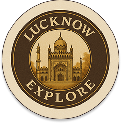
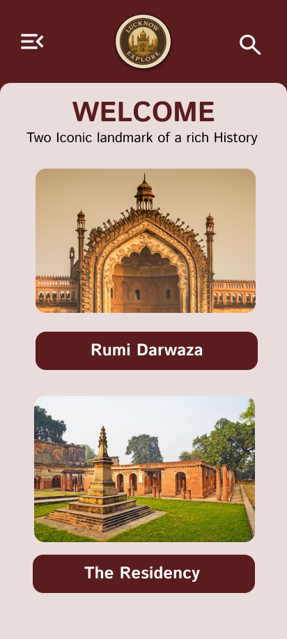

# 🏛️ Lucknow Explore

<p align="center">
  
</p>

<h1 align="center">Lucknow Explore</h1>

<p align="center">
An Offline Multilingual Tourist Guide Application for Exploring Lucknow's Historical Heritage
</p>

<p align="center">
  
  
  
  
  
</p>

---

## 📖 Overview

Lucknow Explore is an offline multilingual tourist guide application developed using Flutter. The application aims to provide visitors with an immersive and informative experience while exploring the historical heritage of Lucknow.

The app currently focuses on two iconic landmarks:

- 🏰 Rumi Darwaza
- 🏛️ The Residency

The application is designed to work completely offline, allowing tourists to access information, images, maps, and audio guides without requiring an internet connection.

---

## 🎯 Objectives

- Promote the cultural heritage of Lucknow.
- Provide tourists with authentic historical information.
- Eliminate dependency on internet connectivity.
- Overcome language barriers through multilingual support.
- Enhance tourist engagement using audio guides and interactive content.

---

## ✨ Features

### 🌐 Multilingual Support
- Support for Top 10 Indian Languages.
- Dynamic language switching.
- Localized content using JSON files.
- User-friendly language selection interface.

### 🔊 Offline Audio Guide
- Text-to-Speech (TTS) integration.
- Historical descriptions converted into audio.
- Audio available in selected languages.
- Fully offline functionality.

### 🖼️ Historical Gallery
- Offline image storage.
- High-quality photographs.
- Easy image browsing experience.

### 🗺️ Offline Maps
- Location markers for tourist sites.
- Offline navigation support.
- Easy access to attraction locations.

### 📚 Historical Information
- Architectural details.
- Historical significance.
- Cultural relevance.
- Tourist-friendly descriptions.

### 📩 Help & Support
- User query submission form.
- Feedback collection.
- Simple support interface.

### ℹ️ About Us
- Project details.
- Mission and vision.
- Application information.

---

# 📱 Application Screenshots

## App Logo

<p align="center">
  
</p>

---

## Welcome Screen

<p align="center">
  
</p>

The welcome screen introduces users to the application and allows them to start exploring Lucknow's heritage.

---

## Home Screen

<p align="center">
  
</p>

Users can select from the two historical attractions:

- Rumi Darwaza
- The Residency

---

## Rumi Darwaza

<p align="center">
  
</p>

### About

Rumi Darwaza is one of the most iconic architectural landmarks of Lucknow and a symbol of Awadhi culture. Built in 1784 by Nawab Asaf-ud-Daula, it stands as a magnificent example of Mughal architecture.

### Available Features

- Historical Description
- Offline Audio Guide
- Image Gallery
- Offline Map
- Multilingual Content

---

## The Residency

<p align="center">
  
</p>

### About

The Residency is a historic complex that played a significant role during the Indian Rebellion of 1857. Today, it serves as a reminder of India's rich historical past.

### Available Features

- Historical Information
- Offline Navigation
- Gallery View
- Audio Narration
- Multilingual Support

---

# 🏗️ Application Flow

```text
Splash Screen
      ↓
Welcome Screen
      ↓
Language Selection Screen
      ↓
Home Screen
      ↓
Select Tourist Site
      ↓
Description Page
      ↓
 ┌──────────────┬──────────────┬──────────────┐
 │ Audio Guide │ Gallery View │ Offline Map │
 └──────────────┴──────────────┴──────────────┘
